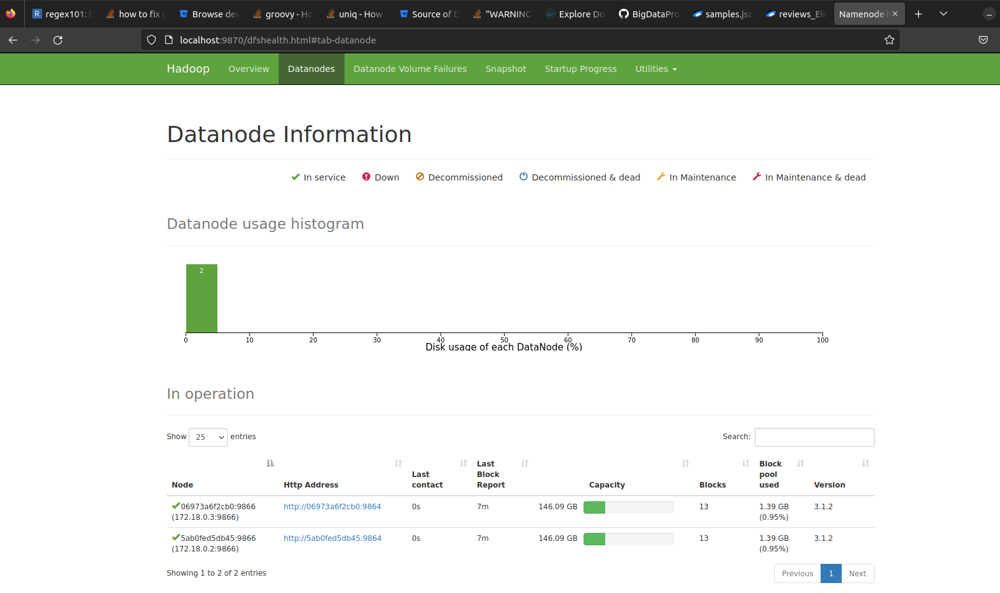
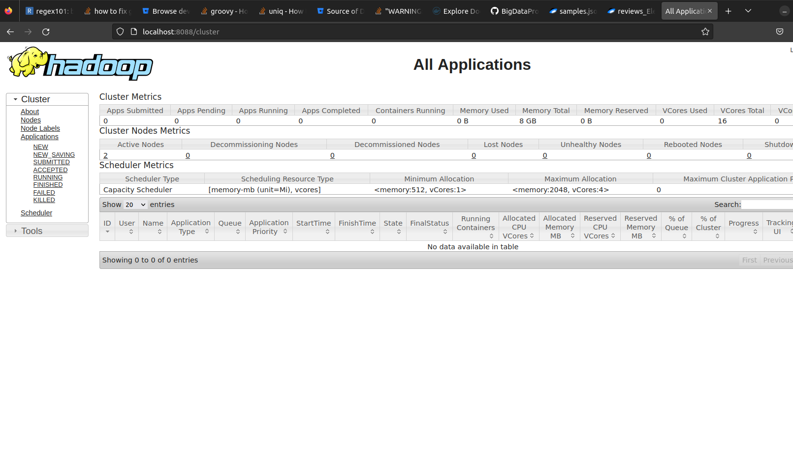
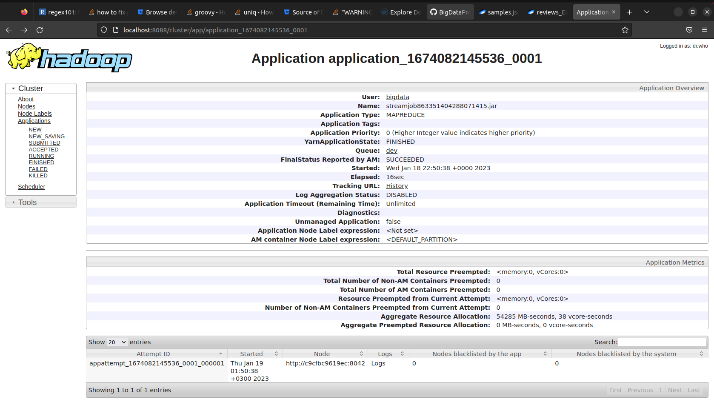

## **<u>Домашнее задание 2.</u>**

## Проверка работы нод
```
nocturnalq@1440:~/BigDataProc_HomeWorks/HomeWork_1$ docker logs homework_1-worker-1
Start SSH service
 * Starting OpenBSD Secure Shell server sshd
   ...done.
Start Hadoop daemons
WARNING: /home/bigdata/hadoop/logs does not exist. Creating.
Start yarn's nodemanager
```
```
nocturnalq@1440:~/BigDataProc_HomeWorks/HomeWork_1$ docker logs master
Start SSH service
 * Starting OpenBSD Secure Shell server sshd
   ...done.
Start Hadoop daemons
Copy files to HDFS
The entrypoint script is completed
```

## Просмотр запущенных datanodes (запускал на двух нодах из-за ресурсов пк)
```
nocturnalq@1440:~/BigDataProc_HomeWorks/HomeWork_1$ docker exec master bash hdfs dfsadmin -printTopology
Rack: /default-rack
   172.18.0.3:9866 (homework_1-worker-2.homework_1_hd-network)
   172.18.0.4:9866 (homework_1-worker-1.homework_1_hd-network)
```

## Просмотр data директории
```
nocturnalq@1440:~/BigDataProc_HomeWorks/HomeWork_1$ docker exec -it master hdfs dfs -ls /data
Found 2 items
-rw-r--r--   3 bigdata supergroup 1478965298 2023-01-18 22:23 /data/reviews_Electronics_5.json
-rw-r--r--   3 bigdata supergroup      12106 2023-01-18 22:23 /data/samples.json
```
## Просмотр Datanodes Tab

<center>



<i>Figure 1. Таблица Datanodes </i></center>

## Просмотр Yarn Datanodes

<center>



<i>Figure 2. YARN: Nodes</i></center>

## Вывод после запуска скрипта 
```
nocturnalq@1440:~/BigDataProc_HomeWorks/HomeWork_1$ docker exec master bash yarn jar /home/bigdata/hadoop/share/hadoop/tools/lib/hadoop-streaming-3.1.2.jar \
                            -D mapreduce.job.reduces=2 \
                            -file /home/bigdata/app/py/wordcountapp/tokenizer_mapper.py -mapper 'python tokenizer_mapper.py' \
                            -file /home/bigdata/app/py/wordcountapp/intsum_reducer.py -reducer 'python intsum_reducer.py' \
                            -input /data/samples.json \
                            -output /data/output.txt
2023-01-18 22:50:36,137 WARN streaming.StreamJob: -file option is deprecated, please use generic option -files instead.
packageJobJar: [/home/bigdata/app/py/wordcountapp/tokenizer_mapper.py, /home/bigdata/app/py/wordcountapp/intsum_reducer.py, /tmp/hadoop-unjar543508325727115823/] [] /tmp/streamjob863351404288071415.jar tmpDir=null
2023-01-18 22:50:37,045 INFO client.RMProxy: Connecting to ResourceManager at master/172.18.0.2:8032
2023-01-18 22:50:37,262 INFO client.RMProxy: Connecting to ResourceManager at master/172.18.0.2:8032
2023-01-18 22:50:37,507 INFO mapreduce.JobResourceUploader: Disabling Erasure Coding for path: /tmp/hadoop-yarn/staging/bigdata/.staging/job_1674082145536_0001
2023-01-18 22:50:37,896 INFO mapred.FileInputFormat: Total input files to process : 1
2023-01-18 22:50:38,043 INFO mapreduce.JobSubmitter: number of splits:2
2023-01-18 22:50:38,231 INFO mapreduce.JobSubmitter: Submitting tokens for job: job_1674082145536_0001
2023-01-18 22:50:38,233 INFO mapreduce.JobSubmitter: Executing with tokens: []
2023-01-18 22:50:38,445 INFO conf.Configuration: resource-types.xml not found
2023-01-18 22:50:38,446 INFO resource.ResourceUtils: Unable to find 'resource-types.xml'.
2023-01-18 22:50:38,909 INFO impl.YarnClientImpl: Submitted application application_1674082145536_0001
2023-01-18 22:50:38,948 INFO mapreduce.Job: The url to track the job: http://master:8088/proxy/application_1674082145536_0001/
2023-01-18 22:50:38,950 INFO mapreduce.Job: Running job: job_1674082145536_0001
2023-01-18 22:50:46,039 INFO mapreduce.Job: Job job_1674082145536_0001 running in uber mode : false
2023-01-18 22:50:46,040 INFO mapreduce.Job:  map 0% reduce 0%
2023-01-18 22:50:52,105 INFO mapreduce.Job:  map 100% reduce 0%
2023-01-18 22:50:56,132 INFO mapreduce.Job:  map 100% reduce 100%
2023-01-18 22:50:56,145 INFO mapreduce.Job: Job job_1674082145536_0001 completed successfully
2023-01-18 22:50:56,240 INFO mapreduce.Job: Counters: 53
        File System Counters
                FILE: Number of bytes read=20822
                FILE: Number of bytes written=920066
                FILE: Number of read operations=0
                FILE: Number of large read operations=0
                FILE: Number of write operations=0
                HDFS: Number of bytes read=16378
                HDFS: Number of bytes written=7770
                HDFS: Number of read operations=16
                HDFS: Number of large read operations=0
                HDFS: Number of write operations=4
        Job Counters 
                Launched map tasks=2
                Launched reduce tasks=2
                Data-local map tasks=2
                Total time spent by all maps in occupied slots (ms)=6642
                Total time spent by all reduces in occupied slots (ms)=4259
                Total time spent by all map tasks (ms)=6642
                Total time spent by all reduce tasks (ms)=4259
                Total vcore-milliseconds taken by all map tasks=6642
                Total vcore-milliseconds taken by all reduce tasks=4259
                Total megabyte-milliseconds taken by all map tasks=3400704
                Total megabyte-milliseconds taken by all reduce tasks=2180608
        Map-Reduce Framework
                Map input records=5
                Map output records=2193
                Map output bytes=16424
                Map output materialized bytes=20834
                Input split bytes=176
                Combine input records=0
                Combine output records=0
                Reduce input groups=869
                Reduce shuffle bytes=20834
                Reduce input records=2193
                Reduce output records=869
                Spilled Records=4386
                Shuffled Maps =4
                Failed Shuffles=0
                Merged Map outputs=4
                GC time elapsed (ms)=205
                CPU time spent (ms)=2660
                Physical memory (bytes) snapshot=1018765312
                Virtual memory (bytes) snapshot=8654884864
                Total committed heap usage (bytes)=871366656
                Peak Map Physical memory (bytes)=302440448
                Peak Map Virtual memory (bytes)=2162462720
                Peak Reduce Physical memory (bytes)=207593472
                Peak Reduce Virtual memory (bytes)=2165080064
        Shuffle Errors
                BAD_ID=0
                CONNECTION=0
                IO_ERROR=0
                WRONG_LENGTH=0
                WRONG_MAP=0
                WRONG_REDUCE=0
        File Input Format Counters 
                Bytes Read=16202
        File Output Format Counters 
                Bytes Written=7770
2023-01-18 22:50:56,241 INFO streaming.StreamJob: Output directory: /data/output.txt
```

## Результат выполнения в Hadoop UI

<center>



<i>Figure 3. HADOOP: App</i></center>

## Остановка docker compose
```
nocturnalq@1440:~/BigDataProc_HomeWorks/HomeWork_1$ dcompose down
[+] Running 4/4
 ⠿ Container master               Removed                                                                                                                                                                                                                                                             10.6s
 ⠿ Container homework_1-worker-1  Removed                                                                                                                                                                                                                                                             10.6s
 ⠿ Container homework_1-worker-2  Removed                                                                                                                                                                                                                                                             10.6s
 ⠿ Network homework_1_hd-network  Removed
```

